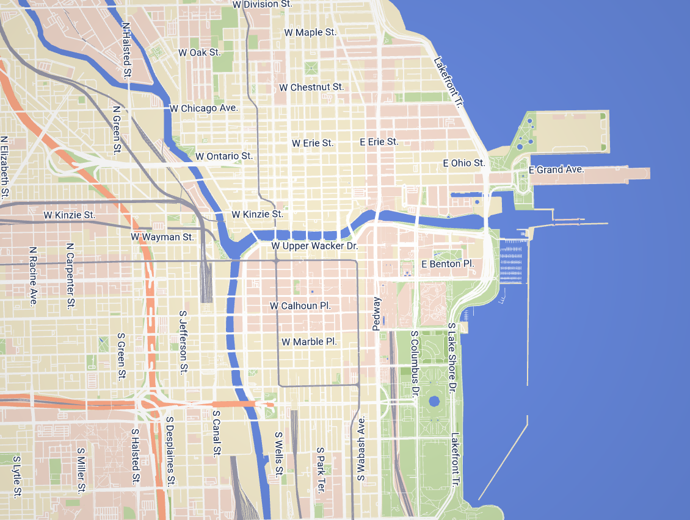
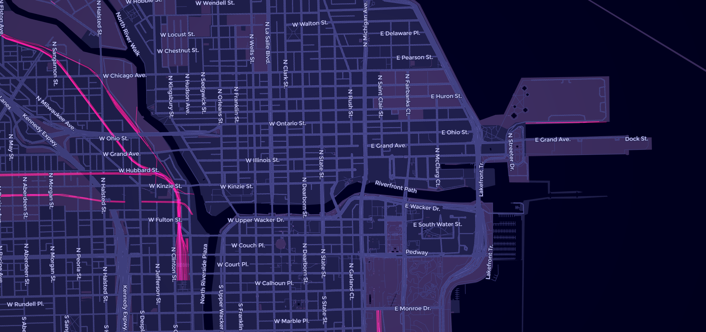
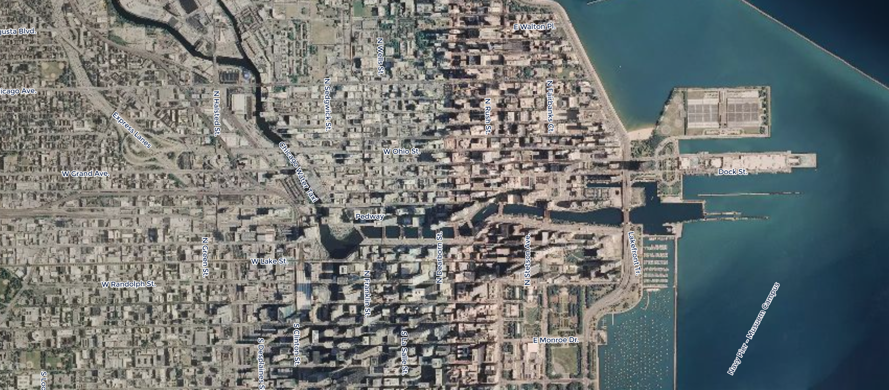

# StreetComplete Mapstyle

The goal of this project is to create a new style for the map which will be used by the android application [StreetComplete](https://github.com/westnordost/StreetComplete)

  

## Getting started

### What is missing?

To get an overview of what is missing on the map, you should have a look at the [issue tracker](https://github.com/ENT8R/streetcomplete-mapstyle/issues) of this repository. Everything which is missing on the map should be documented there. And if you have a new idea which you can't find in the issue tracker, then you can simply open a new issue for that and tell us about your idea!

If you start to edit the style keep in mind that:
* the map should not distract from the app's sole purpose
* StreetComplete is not a map application (map has not to be very detailed)

### What should not be added?
* No POIs
* No elements which have no relation to the [quests](http://wiki.openstreetmap.org/wiki/StreetComplete/Quests) of StreetComplete
* Only things need to be shown that matter on the survey (on foot)
* That's it! Go ahead and create something awesome!

## Contributing

* Open the code in Tangram Play ([Normal map](https://tangram.city/play/?scene=https://raw.githubusercontent.com/ENT8R/streetcomplete-mapstyle/master/streetcomplete-light-style.yaml),  [Satellite map](https://tangram.city/play/?scene=https://raw.githubusercontent.com/ENT8R/streetcomplete-mapstyle/master/streetcomplete-satellite-style.yaml), [Dark map](https://tangram.city/play/?scene=https://raw.githubusercontent.com/ENT8R/streetcomplete-mapstyle/master/streetcomplete-dark-style.yaml))
* Change or add something to the style
* Download the file after you did your work
* Make a pull request to this repository

## Useful links

* [Tangram documentation](https://mapzen.com/documentation/tangram/)
* [Tangram Play](https://tangram.city/play/)
* [View normal map](https://map-data.de/#style=streetcomplete-light)
* [View dark map](https://map-data.de/#style=streetcomplete-dark)
* [Issue #183 of StreetComplete](https://github.com/westnordost/StreetComplete/issues/183) (The reason why this repository was created)
